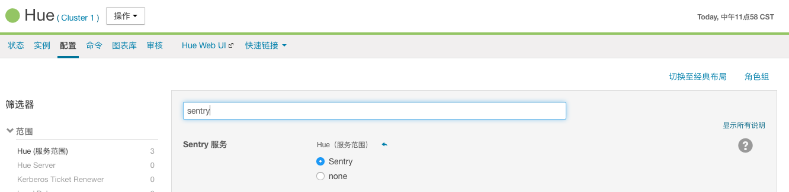
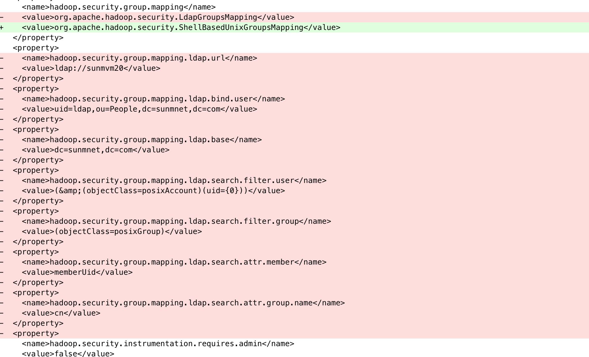
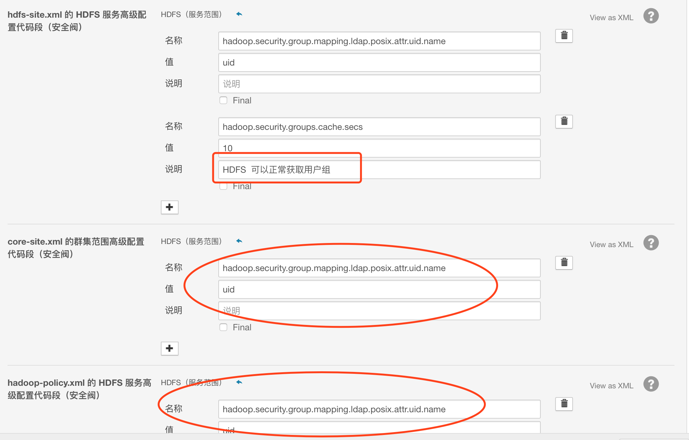

本文主要介绍CDH5.9中的各个服务集成LDAP，Sentry等的配置。

# 1.Hive集成LDAP
## 配置：在CDH->hive->配置->高级 中找到下面这项：
`hive-site.xml 的 HiveServer2 高级配置代码段（安全阀）`

添加如下配置：

```xml
<property>
  <name>hive.server2.authentication</name>
  <value>LDAP</value>
</property>
<property>
  <name>hive.server2.authentication.ldap.url</name>
  <value>ldap://sunmvm20</value>
</property>
<property>
  <name>hive.server2.authentication.ldap.baseDN</name>
  <value>ou=people,dc=0hkj,dc=com</value>
</property>
```
重启Hive。
## 验证
使用 beeline 验证：
```shell
beeline -u "jdbc:hive2://sunmvm26:10000/default" -n test -p test
```
# 2.Impala集成LDAP
## 配置：CDH->impala->配置  做如下配置
* 启用LDAP身份验证 = true
* LDAP URL = ldap://sunmvm20
* 启用LDAP TLS = true
* LDAP BaseDN = ou=people,dc=0hkj,dc=com
重启impala。

## 验证
```shell
impala-shell -l -u hive --auth_creds_ok_in_clear

beeline -u "jdbc:hive2://sunmvm28:21050/default;" -n test -p test
```
# 3.HUE集成LDAP
在Cloudera Mnager 中修改 HUE 配置，使用搜索绑定进行认证:

```shell
backend = desktop.auth.backend.LdapBackend
ldap_url = ldap://sunmvm20

# 使用搜索绑定认证
Use Search Bind Authentication = true
LDAP 搜索基础base_dn:  dc=ohkj,dc=com
LDAP 绑定用户可分辨名称bind_dn:  uid=ldapadmin,ou=people,dc=ohkj,dc=com
LDAP 绑定密码bind_password = ${BIND_PASSWORD}
LDAP User Filter = (objectClass=posixAccount)
LDAP user_name_attr = uid
LDAP group_filter = (objectClass=posixGroup)
LDAP group_name_attr = cn
LDAP group_member_attr = memberUID
```

# Hive集成Sentry
在CM上转入Hive的配置页面：

* 取消勾选 HiveServer2 启用模拟属性
* 设置Sentry 服务属性为 Sentry

CDH中只需要配置上面两项即可，其余配置文件CDH会自动配置好。

# Impala集成Sentry

# HUE集成Sentry


# 用户、用户组映射配置（HUE，HDFS，Sentry）
打通平台用户体系（Unix / HDFS / LDAP / HUE / Sentry ）,统一走LDAP管理。

## HDFS
配置HDFS使用LDAP的用户、用户组

使用下面命令，查看test用户的用户组
```shell
hdfs groups test
```

如果LDAP中一个用户有多个用户组，sentry中只能取到gidNumber对应的那个用户组，其他的用户组取不到。查看LdapGroupsMapping源码，添加下面配置即可


## Sentry
Hive（服务范围）下
hive.sentry.provider配置为默认值
org.apache.sentry.provider.file.HadoopGroupResourceAuthorizationProvider

# HUE本地调试环境搭建
参考 http://swifter.love/2017/06/01/PyCharm调试Hue教程/


# HUE汉化方法

* 1.修改配置文件
vi /opt/soft/hadoop/hue-3.10.0/desktop/core/src/desktop/settings.py
```shell
LANGUAGE_CODE = 'zh_CN'
LANGUAGES = [
  ('en-us', _('English')),
  ('zh_CN', _('Simplified Chinese')),
]
```
* 2.重新编译
```shell
cd  /opt/soft/hadoop/hue-3.10.0
make apps
```
* 3.执行
```shell
make locales
```
* 4.启动hue
```shell
./build/env/bin/hue runserver 127.0.0.1:8000
```
